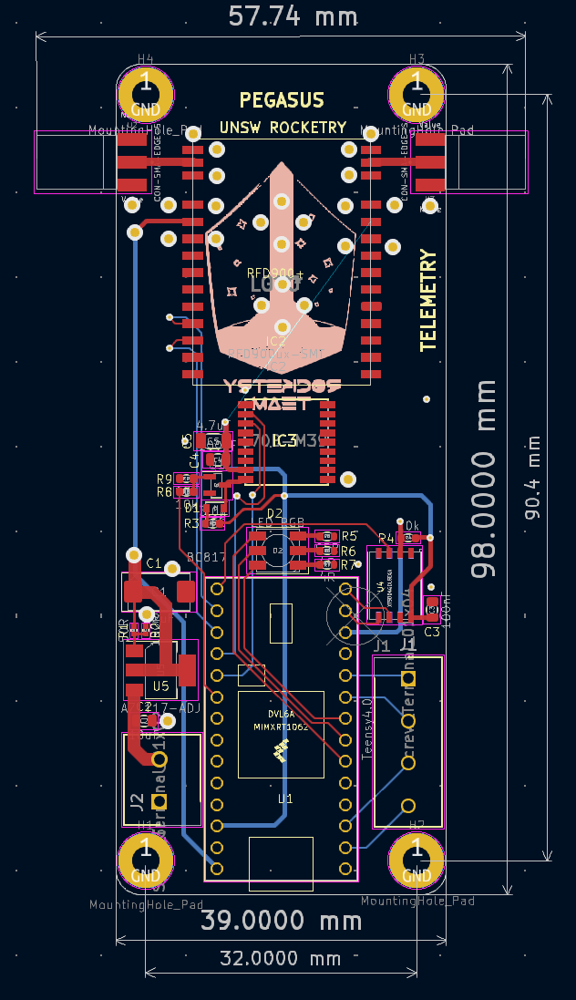
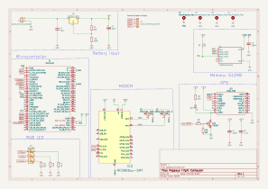
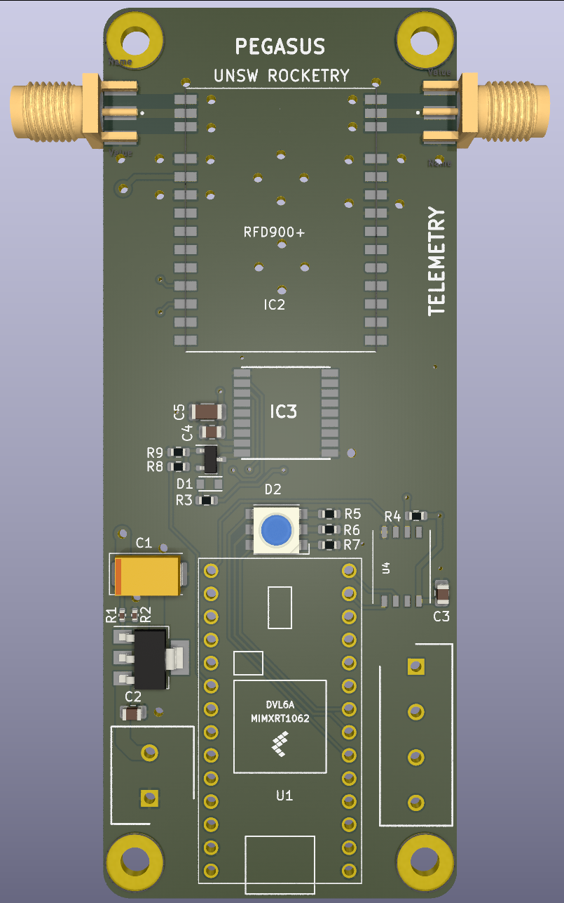
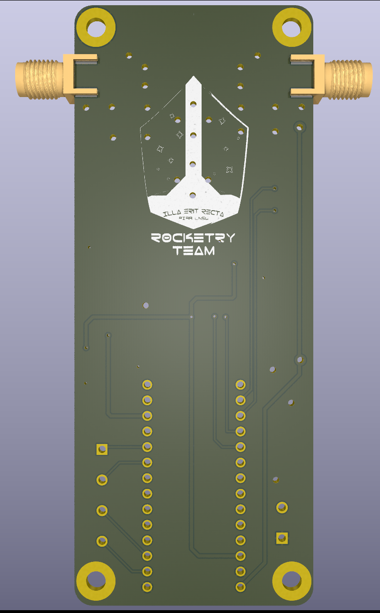

Schematic And PCB Design for Pegasus Flight Computer in Kicad. 
Designed to track 3D position via GPS and transmit to ground station.
Originally developed for the UNSW Rocketry Team.

**PARTS LIST:**

- Microprocessor: Teensy 4
- GPS: Quectel L70B-M39
- Radio Transceiver: RFD900ux
- Memory: XTSD 4GB NAND Flash
- RGB LED

---
## 📸 Overview

### 📐 PCB Layout

**Dimensions**: 
- 98.0 mm × 39 mm board length
- 98.0mm x 57.74 mm maximum horizontal (due to antennas)
  
**Mounting Holes**: ⌀3.2 mm (4-cornered)

---
## 📊 Schematic

---

### ⚙️ Render – Front Side

---

### 🔧 Render – Back Side

